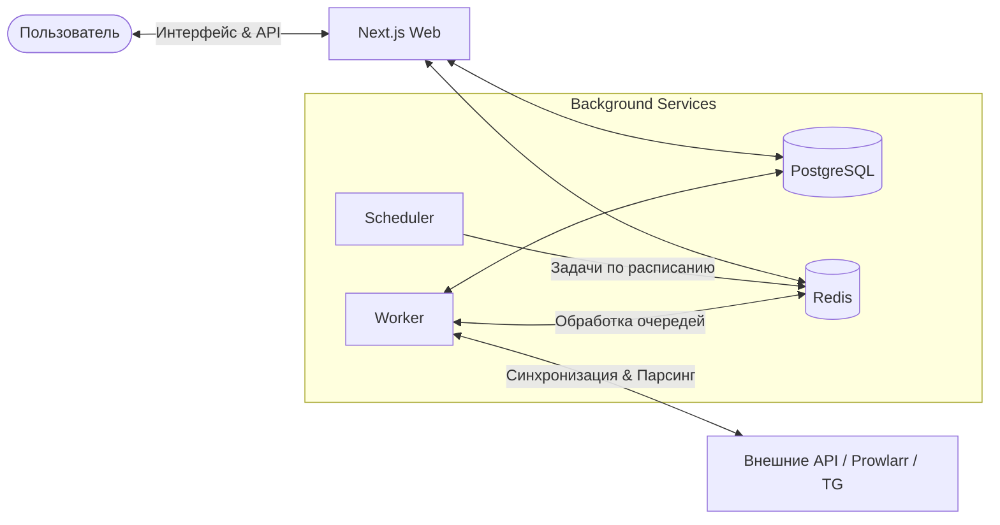

  

<h1 align="center">AniSync</h1>

  <strong>Единый центр управления вашей медиатекой.</strong> 
  Аниме, сериалы, фильмы и автоматический поиск раздач — в одном месте.

  

  
  
  
  
  

---

## 🚀 О проекте

**AniSync** решает проблему «сотни открытых вкладок». Это современный, быстый и минималистичный PWA-сервис, который объединяет трекинг аниме, отслеживание премьер кино и умную автоматизацию поиска торрентов в единый хаб.

Больше не нужно вручную проверять обновлённые списки, календарь релизов и трекеры — AniSync берет фоновую рутину на себя и присылает уведомления прямо в Telegram.

### ✨ Ключевые фичи

* **🧩 Модульность без лишнего шума:** Включайте только те модули, которыми реально пользуетесь.
* **📱 Полноценный PWA:** Устанавливается как нативное приложение на смартфон или ПК, работает быстро и без задержек.
* **⚡ Мгновенный UI:** Фоновые очереди не блокируют интерфейс — все долгие синхронизации и поиски происходят незаметно для пользователя.
* **🌍 Мультиязычность:** Полная поддержка русского и английского языков (i18n).

---

## 📦 Модули

| Модуль | Описание | Интеграции |
| :--- | :--- | :--- |
| **🎌 Anime** | Двусторонняя синхронизация списка аниме, статусов и прогресса просмотров в реальном времени. | Shikimori · MyAnimeList · AniList |
| **🎬 Releases** | Персональный Watchlist, расписание и даты выхода новых эпизодов сериалов и мировых кинопремьер. | TMDB |
| **🧲 Torrents** | Умный мониторинг и автопоиск торрентов по критериям с фильтрацией мусора и уведомлениями. | Prowlarr · Telegram |

> 🤖 **Smart Torrent Hunting:** Модуль торрентов умеет отсеивать «экранки» (CAM/TS), находит нужные озвучки, фильтрует качество и отправляет прямую magnet-ссылку с постером прямо в ваш Telegram.

---

## 🛠 Архитектура

Проект построен по принципу **Modular Monolith** — три домена объединяет общая база данных, единая система авторизации, центр уведомлений и фоновые очереди задач.

### Разделение процессов

1. **`web`** — реактивный UI и Fast API.
2. **`scheduler`** — генерирует периодические таски (проверка дат, поиск торрентов).
3. **`worker`** — забирает «тяжёлую» работу из **BullMQ** (фоновый импорт, сканирование трекеров, отправка push/TG уведомлений).

---

## 🛠 Технологический стек

* **Frontend & Backend:** Next.js 15 (App Router), React 19, TypeScript
* **State & Query:** TanStack Query, `next-intl` (i18n)
* **UI & Styling:** Tailwind CSS, Radix UI / shadcn/ui
* **Database & ORM:** PostgreSQL, Drizzle ORM
* **Queues & Cache:** Redis, BullMQ
* **PWA:** Serwist
* **Deployment:** Docker Compose (`web`, `worker`, `scheduler`)

---

## 🔗 Попробуйте сами

Готовый к работе инстанс доступен по адресу:

👉 **[anisync.ru](https://anisync.ru)**

---

## 📄 Лицензия

Распространяется под лицензией **MIT**.

© 2025–2026 [Denis Ershov](/LICENSE)