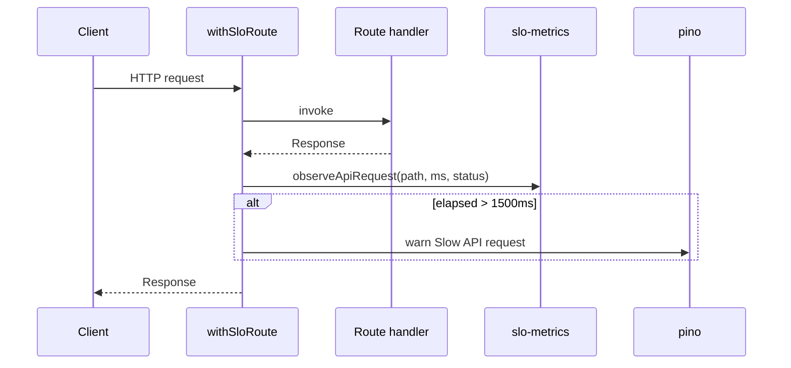

# Архитектура API

> **Версия:** 1.0  
> **Дата:** 2026-06-16

---

## Обзор

AniSync использует **Next.js App Router** route handlers под префиксом `/api`. Модули платформы изолируют свои endpoints:

| Модуль | Префикс | Спецификация |
|--------|---------|--------------|
| Core auth | `/api/auth/*` | Встроенные маршруты AniSync |
| Anime library | `/api/user/*` | См. `DB_ARCHITECTURE.md` |
| Releases | `/api/releases/*` | `docs/openapi/releases.yaml` |
| Health | `/api/health/*` | Защищённые operational endpoints |

---

## Observability (SLO)

### In-memory метрики

- **Модуль:** `src/lib/observability/slo-metrics.ts`
- **Обёртка:** `src/lib/api/with-slo.ts` — `withSloRoute(path, handler)`
- **Endpoint:** `GET /api/health/slo` — p50/p95/p99, error rate по ключевым маршрутам

Отслеживаемые пути (`SLO_TRACKED_PATHS`):

- `/api/releases/content/upcoming`
- `/api/releases/content/trending`
- `/api/releases/watchlist`
- `/api/auth/login`

### Медленные запросы

Запросы дольше `API_SLOW_REQUEST_MS` (по умолчанию **1500 ms**) логируются через **pino** (`module: api:slo`, уровень `warn`).

### Доступ к health/SLO

В production требуется `CRON_SECRET` через `Authorization: Bearer` или заголовок `x-health-secret` (`src/lib/api/health.ts`).

---

## Поток запроса (Releases + SLO)

---

## OpenAPI

Спецификация модуля Releases: **`docs/openapi/releases.yaml`** (OpenAPI 3.1).

Источник: адаптация `NextScene/lib/api-spec/openapi.yaml` с префиксом `/releases/` и auth AniSync (email вместо username).

Генерация клиента (Orval) — опционально на фазе 2.2.3.

---

## Ключевые решения

1. **Обёртка вместо глобального middleware** — в App Router middleware не измеряет время handler; SLO вешается на route через `withSloRoute`.
2. **Шаблонные пути** — динамические сегменты агрегируются как `/api/releases/content/[tmdbId]`, а не по конкретным ID.
3. **In-memory buckets** — подходит для single-instance и dev; для multi-instance в production позже — Redis/Prometheus.
