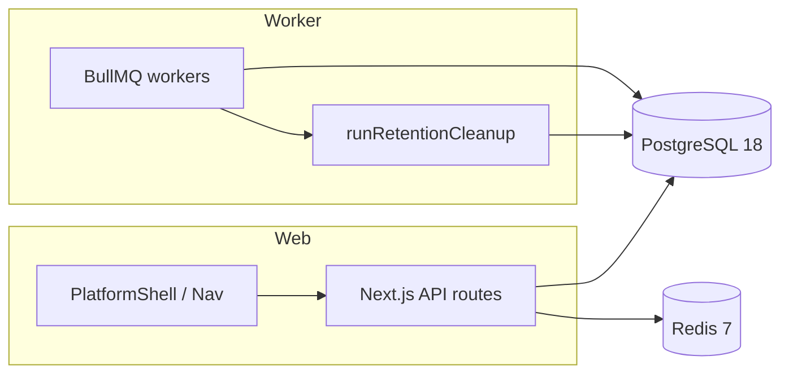

# Архитектура базы данных AniSync Platform

> **Версия:** 1.0  
> **Дата:** 2026-06-16  
> **СУБД:** PostgreSQL 18 (Coolify resource `anisync-postgres`)

---

## Обзор

AniSync использует **Drizzle ORM** и additive-миграции в `drizzle/`. Схема описана в `src/lib/db/schema.ts`.

Платформа разделена на bounded contexts:

| Контекст | Основные таблицы | Назначение |
|----------|------------------|------------|
| Identity | `users`, `user_sessions`, `user_settings` | Аутентификация, роли, настройки модулей |
| Anime | `anime_catalog`, `anime_service_ids`, `user_library_entries`, `sync_jobs` | Библиотека аниме и синхронизация провайдеров |
| Cross-media IDs | `media_external_ids` | Связь TMDB / IMDB / MAL / AniList / Shikimori |
| Notifications | `notifications` | Единый hub уведомлений по модулям |
| Releases (фаза 2+) | `release_watchlist_entries` | Watchlist фильмов/сериалов (TMDB) |
| Torrents (фаза 3–4) | `torrent_watchlist`, `torrent_releases`, `torrent_notification_log` | Целевые таблицы cutover NW (`0006`); runtime watcher пока на NW PG |

---

## Identity

### `users`

- `role`: `user` | `admin` — RBAC для админ-функций и cutover.
- `display_name`: отображаемое имя (опционально).
- `username`, `email`, `password_hash`, `bio` — существующие поля.

### `user_sessions`

- Cookie `auth-token` → `session_token` (SHA-256 hash).
- `expires_at` — TTL сессии; cleanup через `maintenance.cleanup` / `runRetentionCleanup()`.

### `user_settings`

- `enabled_modules`: JSONB-массив `['anime', 'releases', 'torrents']`.
- `notification_preferences`: JSONB `{ inApp, telegram, email, telegramChatId }`.
- `theme`, `language`, `primary_service` — UI и дефолтный провайдер.

---

## Notifications hub

### `notifications`

Расширена для мультимодульной платформы:

| Поле | Тип | Описание |
|------|-----|----------|
| `module` | enum | `anime` \| `releases` \| `torrents` \| `platform` |
| `channel` | enum | `in_app` \| `telegram` \| `email` |
| `payload` | JSONB | Произвольные метаданные (episode, tmdbId, magnet и т.д.) |

Сервис: `NotificationHubService` (`src/lib/services/notification-hub-service.ts`).

---

## Cross-media ID mapping

### `media_external_ids`

Единая таблица для связи внешних идентификаторов между модулями:

- `media_type`: `anime` \| `movie` \| `show`
- `tmdb_id`, `imdb_id`, `mal_id`, `anilist_id`, `shikimori_id`

Сервис: `MediaExternalIdsService` (`src/lib/services/media-external-ids-service.ts`).

Индексы: TMDB+type, unique MAL, IMDB.

**Миграция:** `drizzle/0003_platform_foundation.sql`

---

## Retention

Фоновая очистка (`src/lib/maintenance/retention.ts`), очередь `maintenance.cleanup`:

| Сущность | Политика (env) | По умолчанию |
|----------|----------------|--------------|
| `user_sessions` | expired `expires_at` | немедленно |
| `sync_jobs` | completed старше N дней | `RETENTION_SYNC_JOBS_DAYS=180` |
| `sync_job_attempts` | старше N дней | `RETENTION_SYNC_JOB_ATTEMPTS_DAYS=90` |

---

## Поток данных (Foundation)

---

## Ключевые решения

1. **Additive migrations only** — без breaking changes для существующих пользователей AniSync.
2. **`media_external_ids` отдельно от `anime_service_ids`** — последняя привязана к anime catalog; новая таблица — для кросс-модульного matching (аниме ↔ TMDB ↔ torrent).
3. **Notification hub** — одна таблица с `module`/`channel` вместо отдельных таблиц на модуль (NightWatcher `notifications_history` мигрирует сюда в фазе 3).
4. **Sessions** — AniSync `user_sessions` остаётся каноном; mapping с OnTrash `app_sessions` документируется при cutover.

---

## Связанные документы

- [PLATFORM_ARCHITECTURE.md](PLATFORM_ARCHITECTURE.md)
- [GREENFIELD.md](GREENFIELD.md)
