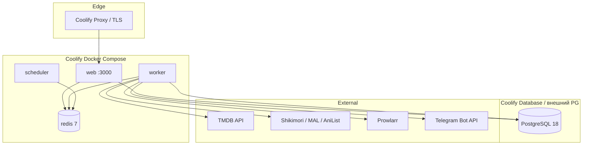

# Архитектура платформы AniSync (целевое состояние)

> **Версия:** 2.0  
> **Дата:** 2026-07-20  
> **Связанные документы:** [MODULE_CONTRACT.md](MODULE_CONTRACT.md), [GREENFIELD.md](GREENFIELD.md)

---

## 1. Принципы

1. **Modular monolith** в одном репозитории `anisync` — три bounded context (Anime, Releases, Torrents), общая платформа (Auth, Notifications, Jobs).
2. **Coolify + Docker Compose** — один ресурс Compose на [`docker-compose.yml`](../docker-compose.yml); env из Coolify UI; домен на сервис `web` (см. [COOLIFY_DEPLOY.md](COOLIFY_DEPLOY.md)).
3. **Очереди с первого дня** — тяжёлая работа только через workers, не в HTTP request.
4. **Горизонтальное масштабирование web**, **вертикальное/реплицируемое** для workers и БД.
5. **Feature flags + debug flags** — включение модулей и отладки без деплоя.
6. **Retention by design** — политики очистки старых данных в схеме и cron jobs.
7. **Greenfield** — единая AniSync DB с нуля; torrent watcher только на TypeScript.

---

## 2. Целевая топология (Coolify + Docker Compose)



### Сервисы

| Сервис | Команда | Порт | Назначение |
|--------|---------|------|------------|
| `web` | `node server.js` (+ миграции) | 3000 → Proxy | SSR + API |
| `worker` | `scripts/worker.ts` | — | BullMQ consumers |
| `scheduler` | `scripts/scheduler.ts` | — | Repeatable jobs |

PostgreSQL и Redis — **внешние** Coolify Database + Connect To Predefined Network (`DATABASE_URL`, `REDIS_URL`).

Пошаговый деплой: [COOLIFY_DEPLOY.md](COOLIFY_DEPLOY.md).

---

## 3. Очереди и фоновые задачи

### Почему не текущий подход

Сейчас в AniSync:
- `sync_jobs` + `user_entry_changes` как DB-outbox
- Dispatch через BullMQ при `REDIS_URL`, иначе `fetch()` на `/api/internal/*`
- Claim pending jobs: `FOR UPDATE SKIP LOCKED` (+ BullMQ concurrency на worker)

Это **недостаточно** для prod на Coolify с нагрузкой и большими библиотеками.

### Рекомендуемый стек

| Компонент | Выбор | Альтернатива |
|-----------|-------|--------------|
| Очередь | **BullMQ** + Redis | Inngest (managed), Trigger.dev |
| Кэш | **Redis** (тот же инстанс, отдельные DB index) | KeyDB |
| Scheduler | BullMQ repeatable jobs | Coolify cron → HTTP (fallback) |
| Idempotency | Redis SET + DB unique constraints | — |

**Почему BullMQ, а не только PostgreSQL queue:**
- Встроенные retry, backoff, dead-letter, rate limiting
- Приоритеты очередей (anime sync vs TMDB refresh vs notifications)
- Метрики через Bull Board (опционально, только admin)
- Redis уже нужен для TMDB cache и session rate-limit

### Очереди (имена)

| Queue | Producer | Consumer | Типичные jobs |
|-------|----------|----------|---------------|
| `anime.sync.primary` | OAuth callback, manual sync | worker | `runPrimaryImport(userId)` |
| `anime.sync.entry` | library PATCH | worker | `syncEntryToProviders(entryId)` |
| `anime.schedule.refresh` | GET /api/user/anime (stale/force), cold start via refreshScheduleSlice | worker | `refreshScheduleSlice(userId)` |
| `releases.tmdb.upcoming` | API cache miss | worker | `buildUpcomingPage(page, filters)` |
| `releases.watchlist.refresh` | scheduler / on-demand | worker | batch TMDB для shows |
| `notifications.dispatch` | любой модуль | worker | in-app + Telegram |
| `torrents.scan` | scheduler / user action | NW worker | Prowlarr scan (фаза 3) |
| `maintenance.cleanup` | scheduler (daily) | worker | retention policies |

### Миграция с текущей схемы

1. Сохранить таблицы `sync_jobs`, `user_entry_changes` как **audit log** (история для UI).
2. Новый flow: API → `queue.add()` → worker обновляет job status в PG.
3. Убрать self-HTTP dispatch после стабилизации workers.

---

## 4. Кэширование и большие данные

### TMDB (из OnTrash — главный риск)

| Проблема сейчас | Решение |
|-----------------|---------|
| In-memory cache per process | **Redis** с TTL + LRU max keys |
| `getUpcoming` сканирует много страниц TMDB | Precompute в worker, хранить в `release_catalog_cache` (PG) или Redis |
| `GET /watchlist` — N×TMDB на запрос | Batch refresh в `releases.watchlist.refresh` queue |
| Нет 429 handling | Token bucket в Redis + retry в BullMQ |

### Anime library

| Проблема сейчас | Решение |
|-----------------|---------|
| `listUserLibrary` без пагинации | Cursor pagination API + индексы |
| In-memory filters (studio, genre) | SQL/JSONB filters или materialized columns |
| Full import в HTTP request | Только через queue |
| `anime_catalog` рост без лимита | Архивация неактивных, индексы на `mal_id`, GIN на `title` (опц.) |

### Torrents

| Проблема сейчас | Решение |
|-----------------|---------|
| `torrent_releases` без cleanup | Retention job: удалять старше N дней, seeders=0 |
| `notifications_history` append-only | Retention 90 дней |
| Orphan rows при delete watchlist | FK + CASCADE или cleanup job |

### Redis namespaces

```
db 0 — BullMQ queues
db 1 — TMDB cache (genres, details, release_dates)
db 2 — rate limits (TMDB, Shikimori per-user)
db 3 — feature flags cache (optional)
```

---

## 5. PostgreSQL 18: схема и индексы

**Версия:** PostgreSQL **18** — отдельный Coolify Database resource, образ `postgres:18-alpine`.

Совместимость со стеком:
- Drizzle ORM + `node-postgres` — без изменений
- Миграции AniSync Drizzle — проверить на чистой PostgreSQL 18 в CI
- PgBouncer: transaction mode, совместим с PG 18 — **отдельный Coolify-сервис** при scale-out (опционально, не в образе app)

### Redis (отдельный Coolify resource)

- Один инстанс Redis на Coolify (отдельный Database resource) — **не** Upstash / внешний managed
- BullMQ (db 0), TMDB cache (db 1), rate limits (db 2) — разные logical DB index на одном Redis
- Backup: RDB/AOF по политике Coolify; критичные данные дублировать в PG где возможно (catalog cache)

### Domains (префиксы таблиц)

- **platform:** `users`, `user_sessions`, `user_settings`, `notifications`, `media_external_ids`, `job_audit`
- **anime:** существующие таблицы без префикса
- **releases:** `release_watchlist_entries`, `release_catalog_cache`
- **torrents:** `torrent_watchlist`, `torrent_releases`, `torrent_notification_log`

### Обязательные индексы (additive)

```sql
-- releases
CREATE INDEX release_watchlist_user_id_idx ON release_watchlist_entries(user_id);
CREATE INDEX release_watchlist_added_at_idx ON release_watchlist_entries(user_id, added_at DESC);

-- jobs audit
CREATE INDEX sync_jobs_status_created_idx ON sync_jobs(status, created_at);
CREATE INDEX user_entry_changes_status_idx ON user_entry_changes(status, created_at);

-- notifications
CREATE INDEX notifications_user_unread_idx ON notifications(user_id, read_at) WHERE read_at IS NULL;

-- sessions cleanup
CREATE INDEX user_sessions_expires_at_idx ON user_sessions(expires_at); -- уже есть

-- torrents retention
CREATE INDEX torrent_releases_created_at_idx ON torrent_releases(created_at);
CREATE INDEX torrent_notification_log_sent_at_idx ON torrent_notification_log(sent_at);
```

### Connection pooling

- Web: `pg` pool max **10** per replica
- Worker: pool max **5** per replica
- Использовать **PgBouncer** (transaction mode) при >2 web replicas или >50 concurrent users

---

## 6. Observability: логи, debug, метрики

### Логирование

| Слой | Инструмент | Формат |
|------|------------|--------|
| Web (Next.js) | **pino** | JSON stdout |
| Worker | **pino** | JSON stdout |

Coolify собирает stdout → можно подключить Loki/Grafana позже.

### Debug mode

```env
DEBUG=false                    # глобальный master switch
DEBUG_MODULES=anime,releases   # или * для всех
DEBUG_LOG_LEVEL=debug          # override LOG_LEVEL
DEBUG_SQL=false                # drizzle query logging
DEBUG_EXTERNAL_API=false       # логировать TMDB/Shikimori request/response (без secrets)
```

Реализация: `src/lib/observability/debug.ts` + middleware, проверка на каждый log call.

**Admin UI:** `/settings/admin/debug` (только `role=admin`) — toggle без рестарта через Redis/DB flag.

### Метрики (минимум для prod)

| Метрика | Источник |
|---------|----------|
| HTTP latency p50/p95 | middleware (как OnTrash SLO) |
| Queue depth / failed jobs | BullMQ events → PG или Prometheus |
| TMDB cache hit rate | Redis counters |
| Sync job duration | `sync_job_attempts` |
| Health | `/api/health` (public liveness), `/api/health/ready` (DB+Redis) |

### Sentry (опционально)

`SENTRY_DSN` уже в config — подключить SDK в web + worker.

---

## 7. Отказоустойчивость

| Сценарий | Стратегия |
|----------|-----------|
| Worker crash mid-job | BullMQ retry + stale job recovery (уже есть 30min timeout) |
| Redis down | Web: read-only mode для catalog cache miss → stale PG cache; jobs: pause consumers |
| PostgreSQL failover | Coolify backup daily; connection retry с exponential backoff |
| TMDB rate limit | Queue backoff + Redis rate limiter |
| Prowlarr unavailable | NW worker: circuit breaker, skip cycle, notify admin |
| Deploy rolling | Web: health ready check; Worker: graceful shutdown (finish current job) |
| Duplicate notifications | Idempotency key: `(user_id, type, entity_id, date)` |

---

## 8. Retention и очистка данных

### Политики (env-configurable)

| Данные | Default TTL | Job |
|--------|-------------|-----|
| `user_sessions` expired | удалять сразу | `maintenance.cleanup` daily |
| `sync_job_attempts` | 90 дней | cleanup |
| `sync_jobs` completed | 180 дней | cleanup |
| `notifications` read | 365 дней | cleanup |
| `torrent_releases` | 180 дней (или seeders=0 >30d) | cleanup |
| `torrent_notification_log` | 90 дней | cleanup |
| `release_catalog_cache` | 7 дней | cleanup |
| BullMQ completed jobs | 7 дней | BullMQ `removeOnComplete` |
| BullMQ failed jobs | 30 дней | BullMQ `removeOnFail` |
| File logs | 14 дней | log rotation |

Все политики в `src/lib/maintenance/retention.ts` + admin override.

---

## 9. Frontend: дизайн, PWA, адаптив

### Design system

- База: существующий shadcn/ui + Tailwind AniSync
- OnTrash: переносить **логику**, не inline styles (#7C3AED) — выровнять под design tokens
- Platform shell: sidebar/tabs **Anime | Releases | Torrents** (feature-flagged)

### PWA

| Компонент | Решение |
|-----------|---------|
| Manifest | `src/app/manifest.ts` — единый web manifest платформы |
| Service Worker | `@serwist/next` → `public/sw.js` (только production build) |
| Offline fallback | `public/offline.html` — precache + document fallback |
| Icons | `public/icons/icon-192.png`, `icon-512.png` (порт из OnTrash) |
| Registration | `SerwistClientProvider` в `[locale]/layout.tsx` |
| Install prompt | `PwaInstallPrompt` — после 2-й auth-сессии, не в standalone |

### Адаптивность (обязательные правила)

- **Никаких `<table>` на mobile/tablet** для списков — карточки/grid
- Touch targets ≥ 44px (как OnTrash)
- Bottom nav на mobile для модулей (паттерн OnTrash AppLayout)
- `safe-area-inset` для iOS PWA
- Discover/Watchlist: server pagination, не грузить всё в клиент

---

## 10. Feature flags

```env
RELEASES_MODULE_ENABLED=false
TORRENTS_MODULE_ENABLED=false
REGISTRATION_OPEN=true
MAINTENANCE_MODE=false
```

Хранение: env defaults + override в `user_settings.enabled_modules` / Redis для global flags.

Файл: `src/lib/feature-flags.ts` — единая точка проверки.

---

## 11. Структура репозитория и API границы

Целевое дерево (modular monorepo) — см. [MODULE_CONTRACT.md](MODULE_CONTRACT.md):

```
anisync/
├── apps/web/                 # Next.js BFF (UI + Route Handlers)
│   └── src/modules/
│       ├── platform/         # auth, nav, notifications, settings
│       ├── anime/
│       ├── releases/
│       └── torrents/         # local API, UI и BullMQ jobs
├── packages/                 # db / flags / observability — по мере нужды
├── docs/                     # PLATFORM + MODULE_CONTRACT + modules/*
└── scripts/                  # platform/ops утилиты
```

Внутри `apps/web`:

```
src/modules/<name>/   — manifest, api, ui, jobs
src/app/api/
  auth/*, user/*           — platform
  anime/*, user/library/*  — anime
  releases/*               — releases
  torrents/*               — torrents local API
  internal/*               — worker / cron
  health/*                 — platform
```

Новый модуль = папка в `modules/` + routes + migrations + feature flag + `docs/modules/<NAME>_ARCHITECTURE.md`. Не трогать соседние домены.

---

## 12. Фазы внедрения инфраструктуры

| Фаза | Что | Зависимости |
|------|-----|-------------|
| **0.5** (новая) | Dockerfile, docker-compose (dev), Coolify blueprint | — |
| **0.6** (новая) | Redis + BullMQ scaffold, worker process | Docker |
| **0.7** (новая) | pino logging + DEBUG flags | — |
| **1** | Platform foundation (как в плане) + queues вместо fetch dispatch | 0.6 |
| **2** | Releases + TMDB Redis cache + batch refresh | 1 |
| **3** | Torrents TS watcher + retention jobs | 1 |
| **4** | Cutover + PWA | 2, 3 |

---

## 13. Зафиксированные решения

| Решение | Выбор |
|---------|--------|
| Репозиторий | Один monorepo `anisync` (pnpm workspace): `apps/web` + `packages/*` |
| BFF | Next.js в `apps/web` (не отдельный Express) |
| Деплой приложения | Coolify Docker Compose: `web` + `worker` + `scheduler` ([COOLIFY_DEPLOY.md](COOLIFY_DEPLOY.md)) |
| PostgreSQL | **18**, внешний (Coolify Database) — только `DATABASE_URL` |
| Redis | внешний Coolify Database — только `REDIS_URL` |
| Очереди | BullMQ поверх `REDIS_URL` |
| Контракт модулей | [MODULE_CONTRACT.md](MODULE_CONTRACT.md) |

## 14. Решения, требующие подтверждения

1. **Bull Board:** включать admin UI для очередей?
2. **Мониторинг:** достаточно Coolify logs или сразу Grafana/Loki?
3. **PgBouncer:** добавлять отдельным сервисом при первом scale-out или сразу?

---

*Документ отражает текущую целевую архитектуру; статус деплоя — в [GREENFIELD.md](GREENFIELD.md) и [docs/CHANGELOG.md](CHANGELOG.md).*
