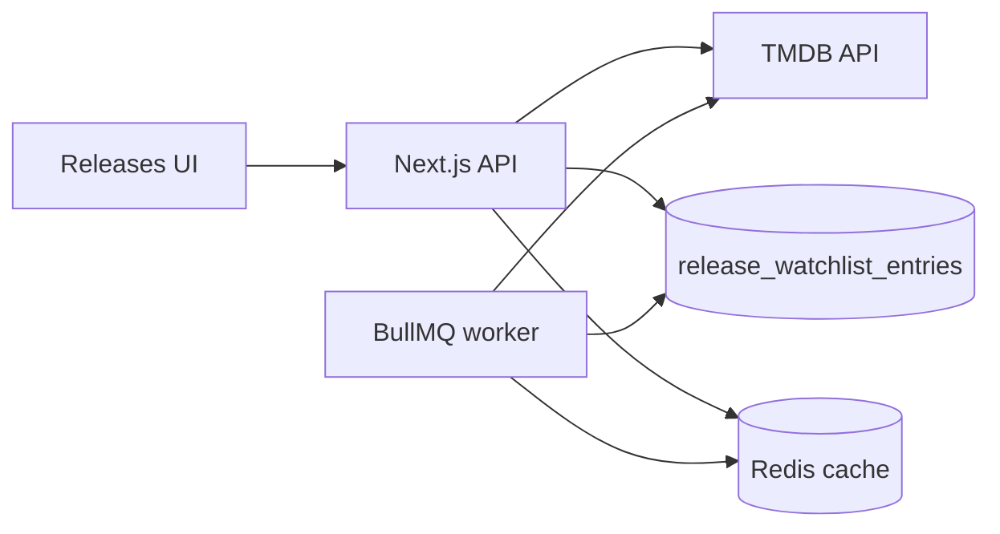

# Архитектура модуля Releases

> **Версия:** 1.1  
> **Дата:** 2026-06-16  
> **Источник:** порт логики OnTrash / NextScene (`backend/src/lib/tmdb.ts`)

---

## Назначение

Модуль **Releases** — календарь цифровых релизов фильмов и сериалов на базе TMDB, с персональным watchlist пользователя AniSync.

---

## Компоненты

| Слой | Путь | Ответственность |
|------|------|-----------------|
| TMDB client | `src/lib/integrations/tmdb/client.ts` | Запросы к TMDB, фильтры жанров, digital release dates, upcoming catalog |
| Health | `src/lib/integrations/tmdb/health.ts` | Проверка `TMDB_API_KEY` |
| Watchlist service | `src/lib/services/release-watchlist-service.ts` | CRUD `release_watchlist_entries` |
| API content | `src/app/api/releases/content/*` | Публичные (auth optional) catalog endpoints |
| API watchlist | `src/app/api/releases/watchlist/*` | Авторизованный watchlist |
| UI | `src/app/[locale]/releases/*` | Dashboard + Discover + Watchlist |
| UI context | `src/components/releases/releases-module-context.tsx` | Общий state модалки и watchlist revision |
| UI modal | `src/components/releases/release-detail-modal.tsx` | Детали TMDB + действия watchlist |
| Cross-module IDs | `media_external_ids` | TMDB → IMDb для связи с Torrents |
| UI schedule | `src/components/releases/releases-dashboard-view.tsx` | 7-дневное расписание |
| Client utils | `src/lib/releases/utils.ts` | Группировка по датам, маппинг watchlist → catalog |
| Client API | `src/lib/releases/api.ts` | Fetch-функции к `/api/releases/*` |
| React Query | `src/lib/releases/hooks.ts`, `query-keys.ts` | Кэш, мутации watchlist, invalidation |
| DB | `release_watchlist_entries` | Персистентный watchlist |

---

## API (MVP)

| Метод | Путь | Описание |
|-------|------|----------|
| GET | `/api/releases/content/trending` | Тренды недели |
| GET | `/api/releases/content/upcoming` | Каталог предстоящих (page, type, sort, genreId) |
| GET | `/api/releases/content/genres` | Список жанров |
| GET | `/api/releases/content/search?query=` | Поиск |
| GET | `/api/releases/content/[tmdbId]?type=movie\|show` | Детали |
| GET | `/api/releases/watchlist` | Watchlist пользователя |
| POST | `/api/releases/watchlist` | Добавить |
| GET | `/api/releases/watchlist/stats` | Статистика |
| PATCH | `/api/releases/watchlist/[id]` | Смена статуса |
| DELETE | `/api/releases/watchlist/[id]` | Удалить |
| GET | `/api/releases/health` | Health модуля + TMDB |

Все endpoints защищены feature flag `RELEASES_MODULE_ENABLED` (503 если выключен).

**OpenAPI:** `docs/openapi/releases.yaml`  
**SLO:** ключевые маршруты обёрнуты в `withSloRoute`; снимок метрик — `GET /api/health/slo` (см. `docs/API_ARCHITECTURE.md`).

---

## Поток данных

---

## Ключевые решения

1. **Порт TMDB client as-is** из OnTrash — сохранены digital US→RU→earliest, genre exclusions, server-side pagination после пост-фильтров.
2. **Redis cache + in-memory fallback** — `src/lib/cache/store.ts` для detail, release dates, upcoming catalog и show schedule; при `REDIS_URL` кэш общий между инстансами.
3. **Worker precompute** — очередь `releases.precompute`, cron `*/30 * * * *`, прогрев популярных комбинаций upcoming.
4. **Batch watchlist refresh** — очередь `releases.watchlist.refresh`, cron hourly; `GET watchlist` читает только БД, без N×TMDB.
5. **Таблица `release_watchlist_entries`** — отдельно от anime library; `schedule_updated_at` для staleness.
6. **IMDb lookup** — `TMDB external_ids` кэшируется в `media_external_ids` и используется для кнопки Torrents в `ReleaseDetailModal`.

---

## UI маршруты

| Путь | Экран |
|------|--------|
| `/releases` | redirect → `/releases/dashboard` |
| `/releases/dashboard` | 7-дневное расписание watchlist |
| `/releases/discover` | Каталог TMDB + поиск |
| `/releases/watchlist` | Список + статистика |

Клик по карточке в любом экране открывает `ReleaseDetailModal` (загрузка `/api/releases/content/[tmdbId]`).

---

## Адаптивность (mobile / tablet)

| Правило | Реализация |
|---------|------------|
| Без `<table>` | Все списки — card grid (`ReleaseContentCard`) |
| Touch targets ≥ 44px | `min-h-11` на кнопках, селектах, табах subnav |
| Фильтры Discover | Desktop: inline row; mobile/tablet: bottom `Sheet` |
| Subnav | Горизонтальный scroll табов на узких экранах, sticky header |
| Расписание | 1 колонка на mobile, 2–3 на desktop |
| Safe area | `env(safe-area-inset-bottom)` в sheet и platform bottom nav |

---

## Env

| Переменная | Назначение |
|------------|------------|
| `TMDB_API_KEY` | Ключ TMDB |
| `RELEASES_MODULE_ENABLED` | Server flag |
| `NEXT_PUBLIC_RELEASES_MODULE_ENABLED` | UI flag |
| `TMDB_UPCOMING_CACHE_TTL_MS` | TTL кэша upcoming catalog |
| `TMDB_SCHEDULE_CACHE_TTL_MS` | TTL кэша расписания сериалов |
| `RELEASES_WATCHLIST_STALE_MS` | Порог устаревания schedule в watchlist |
| `RELEASES_WATCHLIST_REFRESH_CONCURRENCY` | Параллелизм batch refresh |

---

## Связанные документы

- [DB_ARCHITECTURE.md](../DB_ARCHITECTURE.md)
- [PLATFORM_ARCHITECTURE.md](../PLATFORM_ARCHITECTURE.md)
- [GREENFIELD.md](../GREENFIELD.md)
