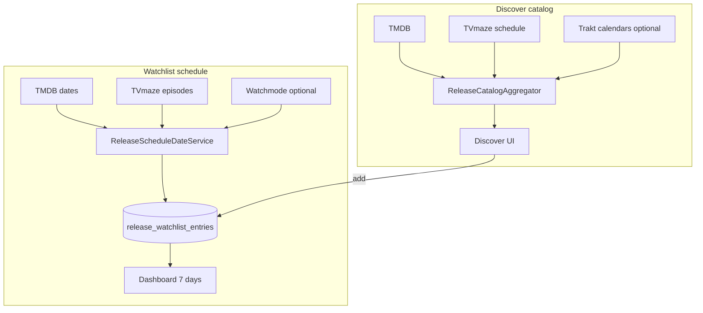

# Архитектура модуля Releases

> **Версия:** 1.2  
> **Дата:** 2026-07-29  
> **Источник:** порт логики OnTrash / NextScene + multi-API catalog/schedule

---

## Назначение

Модуль **Releases** — календарь цифровых релизов фильмов и сериалов с персональным watchlist. Каталог Discover и даты расписания собираются из нескольких бесплатных API (TMDB + TVmaze + опционально Trakt/Watchmode).

---

## Компоненты

| Слой | Путь | Ответственность |
|------|------|-----------------|
| TMDB client | `src/lib/integrations/tmdb/client.ts` | Discover/upcoming, digital release dates, episodes |
| TVmaze client | `src/lib/integrations/tvmaze/client.ts` | Web/broadcast schedule, lookup by IMDb, episodes (`airstamp`) |
| Trakt client | `src/lib/integrations/trakt/client.ts` | Bulk `/calendars/all/*` (optional; `TRAKT_CLIENT_ID` = `trakt-api-key`; OAuth не нужен); 429 → `Retry-After`; обязательный `User-Agent` |
| Watchmode client | `src/lib/integrations/watchmode/client.ts` | Digital movie date fallback (optional; `WATCHMODE_API_KEY`) |
| Catalog aggregator | `src/lib/services/release-catalog-aggregator.ts` | Merge TMDB + TVmaze + Trakt → `CatalogPage`; dedup `{type}:{tmdbId}` |
| Schedule dates | `src/lib/services/release-schedule-date-service.ts` | Единая логика дат: movie digital / show next episode |
| Watchlist service | `src/lib/services/release-watchlist-service.ts` | CRUD + resolve dates при add |
| Watchlist refresh | `src/lib/services/release-watchlist-refresh-service.ts` | Batch refresh movies **и** shows |
| Precompute | `src/lib/services/releases-precompute-service.ts` | Прогрев merged catalog через aggregator |
| API content | `src/app/api/releases/content/*` | Catalog endpoints (`upcoming` → aggregator) |
| API watchlist | `src/app/api/releases/watchlist/*` | Авторизованный watchlist |
| UI | `src/[locale]/releases/*` | Dashboard + Discover + Watchlist |
| Client utils | `src/modules/releases/utils.ts` | `buildWeekSchedule`, `localDateKey` (браузерная TZ) |
| DB | `release_watchlist_entries` | Персистентный watchlist |

---

## Поток данных

---

## Даты расписания

| Тип | Приоритет источников |
|-----|----------------------|
| **movie** | TMDB digital (US→RU) → Watchmode (если ключ) |
| **show** | TMDB episode в окне → TVmaze episodes (`airstamp`) |

Точки применения: `ReleaseWatchlistService.add`, modal add, `ReleaseWatchlistRefreshService.refreshSchedules`, preview в aggregator.

**TZ:** в БД ISO/date strings; UI группирует по `zonedDateKey` / `calendarDateKey`. На карточке Discover/Watchlist и в модалке:
- **movie** — `releaseDate` (цифровой);
- **show** — `nextEpisode` (премьера сезона при E1, иначе S·E + дата).

---

## Кэш

| Ключ / область | TTL | Назначение |
|----------------|-----|------------|
| `releases:catalog:merged:*` / TMDB upcoming TTL | ~30m | Merged Discover |
| per-title schedule movie/show | ~1h | `ReleaseScheduleDateService` |
| `tvmaze:schedule:web:*` | ~24h | Bulk catalog slice |
| `trakt:calendar:*` | ≥1h | Bulk optional; 1–2 GET на окно |

Worker `releases.precompute` прогревает `UPCOMING_PRECOMPUTE_COMBOS` через aggregator.

---

## API

| Метод | Путь | Описание |
|-------|------|----------|
| GET | `/api/releases/content/upcoming` | Merged каталог (контракт `CatalogPage` без breaking change) |
| GET | `/api/releases/content/trending` | Тренды |
| GET | `/api/releases/content/genres` | Жанры TMDB |
| GET | `/api/releases/content/search` | Поиск |
| GET | `/api/releases/content/[tmdbId]` | Детали |
| GET/POST/PATCH/DELETE | `/api/releases/watchlist*` | Watchlist |
| GET | `/api/releases/health` | Health |

Feature flag: `RELEASES_MODULE_ENABLED`. OpenAPI: `docs/openapi/releases.yaml`.

---

## Env

| Переменная | Назначение |
|------------|------------|
| `TMDB_API_KEY` | Обязателен для модуля |
| `TRAKT_CLIENT_ID` | Опционально: bulk streaming/movie calendars |
| `WATCHMODE_API_KEY` | Опционально: digital fallback для фильмов |
| `RELEASES_MODULE_ENABLED` / `NEXT_PUBLIC_RELEASES_MODULE_ENABLED` | Feature flags |
| `TMDB_UPCOMING_CACHE_TTL_MS` | TTL catalog cache |
| `TMDB_SCHEDULE_CACHE_TTL_MS` | TTL schedule cache |
| `RELEASES_WATCHLIST_STALE_MS` | Порог refresh watchlist |

---

## Связанные документы

- [DB_ARCHITECTURE.md](../DB_ARCHITECTURE.md)
- [PLATFORM_ARCHITECTURE.md](../PLATFORM_ARCHITECTURE.md)
- [CHANGELOG.md](../CHANGELOG.md)
