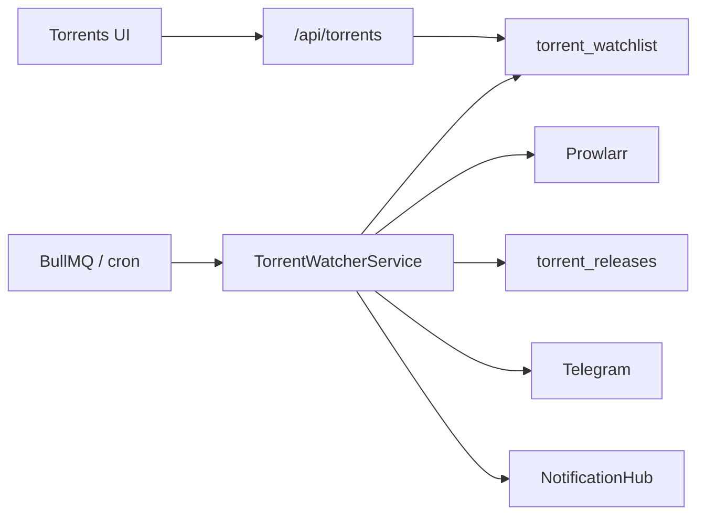

# Архитектура модуля Torrents

> **Версия:** 2.0  
> **Дата:** 2026-07-20  
> **Режим:** greenfield — только **TypeScript watcher в AniSync**

---

## Назначение

Модуль **Torrents** — мониторинг раздач через Prowlarr, хранение в AniSync `torrent_*`, уведомления Telegram + in-app. Python-процесс отсутствует.

---

## Компоненты (целевой стек)

| Слой | Путь | Ответственность |
|------|------|-----------------|
| Facade API | `apps/web/src/app/api/torrents/*` | Auth → `torrent-facade` |
| Local store | `torrent-local-store.ts` | CRUD `torrent_watchlist` / `torrent_releases` |
| **TS Watcher** | `torrent-watcher-service.ts` | Scan due items → Prowlarr → filters → DB → notify |
| Prowlarr | `integrations/prowlarr/client.ts` | searchByImdb / searchByQuery / download link |
| Filters | `lib/torrents/watcher/*` | identity, parsers, quality/audio/season |
| Telegram | `integrations/telegram/bot.ts` | Bot API sendMessage/sendPhoto |
| In-app | `NotificationHubService` | module=`torrents` |
| Queue | BullMQ `torrents.watcher` | every 30 min via scheduler |
| Cron fallback | `POST /api/internal/torrents/watch` | inline scan без Redis |
| UI | `modules/torrents/`, `components/torrents/` | watchlist, prefs, pin/hunting |

---

## Поток данных (greenfield)

---

## Watcher

1. Due-фильтр: `enabled` + `check_interval` / `last_checked` (как NW).
2. Prowlarr IMDb → fallback text queries.
3. Фильтры: IMDb/title, season, quality/audio, bad-audio markers.
4. Dedup `(imdb_id, info_hash)` + `content_hash`.
5. Telegram (per-item `telegram_chat_id` или env) + `torrent_notification_log` + in-app.
6. `notify_once` для movie → disable.
7. Concurrency 5.
8. Torrent bencode → magnet/info hash.
9. Pin-only и hunting auto-pin.

Trigger:
- Scheduler: `*/30 * * * *` → queue `torrents.watcher`
- Manual: `POST /api/internal/torrents/watch` + `Authorization: Bearer $CRON_SECRET`

---

## Хранение

Единственное хранилище: `torrent_*`; единственный watcher: TypeScript worker.

---

## Env

| Переменная | Назначение |
|------------|------------|
| `TORRENTS_MODULE_ENABLED` / `NEXT_PUBLIC_*` | Feature flags |
| `PROWLARR_URL` / `PROWLARR_API_KEY` | Search + health |
| `TELEGRAM_BOT_TOKEN` / `TELEGRAM_CHAT_ID` | Notify |
| `REDIS_URL` | BullMQ (иначе cron inline) |
| `INTERNAL_SERVICE_SECRET` / `CRON_SECRET` | Internal routes |

---

## Связанные документы

- [GREENFIELD.md](../GREENFIELD.md)
- [PLATFORM_ARCHITECTURE.md](../PLATFORM_ARCHITECTURE.md)
- [SERVICE_CONSOLIDATION_IMPLEMENTATION.md](../SERVICE_CONSOLIDATION_IMPLEMENTATION.md)
