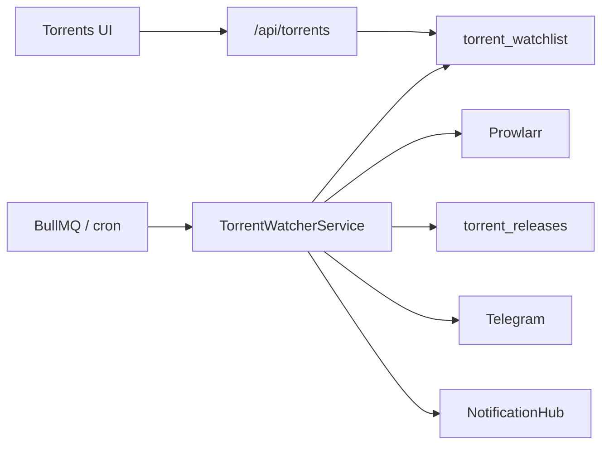

# Архитектура модуля Torrents

> **Версия:** 2.1  
> **Дата:** 2026-07-21  
> **Режим:** greenfield — только **TypeScript watcher в AniSync**

---

## Назначение

Модуль **Torrents** — мониторинг раздач через Prowlarr, хранение в AniSync `torrent_*`, уведомления Telegram + in-app. Python-процесс отсутствует.

---

## Компоненты (целевой стек)

| Слой | Путь | Ответственность |
|------|------|-----------------|
| Facade API | `apps/web/src/app/api/torrents/*` | Auth → `torrent-facade` |
| Local store | `torrent-local-store.ts` | CRUD `torrent_watchlist` / `torrent_releases`; enrich digital/premiere dates via TMDB |
| **TS Watcher** | `torrent-watcher-service.ts` | Scan due items → Prowlarr → filters → DB → notify |
| Prowlarr | `integrations/prowlarr/client.ts` | searchByImdb / searchByQuery / download link |
| Filters | `lib/torrents/watcher/*` | identity, parsers, quality/audio/season |
| Telegram | `integrations/telegram/bot.ts` | Bot API sendMessage/sendPhoto |
| In-app | `NotificationHubService` | module=`torrents` |
| Queue | BullMQ `torrents.watcher` | every 30 min via scheduler |
| Cron fallback | `POST /api/internal/torrents/watch` | inline scan без Redis |
| UI | `modules/torrents/`, `components/torrents/` | watchlist, prefs, pin/hunting |

---

## Поток данных (greenfield)

---

## Watcher & Поиск раздач

1. Due-фильтр: `enabled` + `check_interval` / `last_checked` (как NW).
2. **Комплексный опрос Prowlarr:**
   - Параллельный опрос по IMDb ID (`tt...`, для зарубежных индексаторов) и текстовым запросам (`searchByQuery`, для трекеров RuTracker, NNM-Club, Rutor без поддержки Torznab IMDb).
   - Передача категорий Prowlarr (`categories=2000` для фильмов, `categories=5000` для ТВ-сериалов).
   - Устранен досрочный `break`: запросы по оригинальному и русскому тайтлу опрашиваются полностью, результаты объединяются и дедуплицируются.
3. **Умная фильтрация озвучки и языков:**
   - **Отечественный контент (`isRussianOrigin`):** для российских/советских фильмов и сериалов («Холоп 3», «Слово пацана», «Мастер и Маргарита») русский звук является языком оригинала — раздачи проходят и при выборе `russian`, и при `original`.
   - **Словарь студий и типов озвучки:** распознаются все ведущие релиз-группы (`Red Head Sound`, `HDRezka Studio`, `LostFilm`, `NewComers`, `TVShows`, `AlexFilm`, `ViruseProject`, `Kubik`, `WinMedia`, `Syncmer`, `Le-Production`, `Coldfilm`, `Dragon Money Studio`, `Дубляж TVOЁ`, `Пифагор`, `Flarrow Films`, `Невафильм`, `Кураж-Бамбей` и др.), сокращения трекеров (`ДБ`, `ПД`, `ПМ`, `ЛД`, `ЛМ`, `AVO`, `DVO`, `MVO`), а также маркеры качества (`Лицензия`, `Чистый звук`).
   - **Субтитры:** наличие субтитров не отсекает раздачу, если в релизе присутствует звуковая дорожка или указана студия.
   - **Оригинальная озвучка (`original`):** признает сцен-релизы с международных трекеров (YTS, 1337x, EZTV, TGx), раздачи со сценарными тегами (`WEB-DL`, `BluRay`, `Remux` без русского дубляжа) и мультиязычные релизы (`Rus, Eng`, `Multi`).
4. **Нормализация и генерация поисковых запросов:**
   - Нормализация буквы `ё` -> `е` и разделение цифр и букв в кириллице.
   - Генерация запросов для сериалов под стандарты трекеров (`"1 сезон"`, `"сезон 1"`, `"s01"`).
   - Автоматическое выделение короткого базового названия для составных тайтлов с подзаголовками через точку или двоеточие.
5. **Fair Representation индексаторов в UI кандидатов:**
   - Распределение кандидатов с гарантированной квотой до 8 лучших релизов от каждого ответившего трекера с последующим дозаполнением до общего пула в 50 раздач. Раздачи одного трекера с высоким числом сидеров больше не вытесняют остальные трекеры.
6. Dedup `(imdb_id, info_hash)` + `content_hash`.
7. Telegram (per-item `telegram_chat_id` или env) + `torrent_notification_log` + in-app.
   Формат как NightWatcher: постер + HTML (title/year/IMDb/genre, релиз, размер, magnet / Prowlarr / страница раздачи).
8. `notify_once` для movie → disable.
9. Concurrency 5.
10. Torrent bencode → magnet/info hash.
11. Pin-only и hunting auto-pin; UI-поиск кандидатов для pin — только по кнопке (открепить / заменить pin).
    Unpin и смена pin удаляют прежнюю раздачу из `torrent_releases`.
12. Ручная отправка: `POST /api/torrents/watchlist/[id]/notify` из UI кандидатов.

Trigger:
- Scheduler: `*/30 * * * *` → queue `torrents.watcher`
- Manual: `POST /api/internal/torrents/watch` + `Authorization: Bearer $CRON_SECRET`
- Manual notify: UI → `POST /api/torrents/watchlist/[id]/notify`

---

## Хранение

Единственное хранилище: `torrent_*`; единственный watcher: TypeScript worker.

---

## Env

| Переменная | Назначение |
|------------|------------|
| `TORRENTS_MODULE_ENABLED` / `NEXT_PUBLIC_*` | Feature flags |
| `PROWLARR_URL` / `PROWLARR_API_KEY` | Search + health |
| `PROWLARR_PUBLIC_URL` | Опционально: публичный base для download-ссылок в Telegram (если `PROWLARR_URL` — Docker-internal) |
| `TELEGRAM_BOT_TOKEN` / `TELEGRAM_CHAT_ID` | Notify |
| `REDIS_URL` | BullMQ (иначе cron inline) |
| `INTERNAL_SERVICE_SECRET` / `CRON_SECRET` | Internal routes |

---

## Связанные документы

- [GREENFIELD.md](../GREENFIELD.md)
- [PLATFORM_ARCHITECTURE.md](../PLATFORM_ARCHITECTURE.md)
- [CHANGELOG.md](../CHANGELOG.md)
