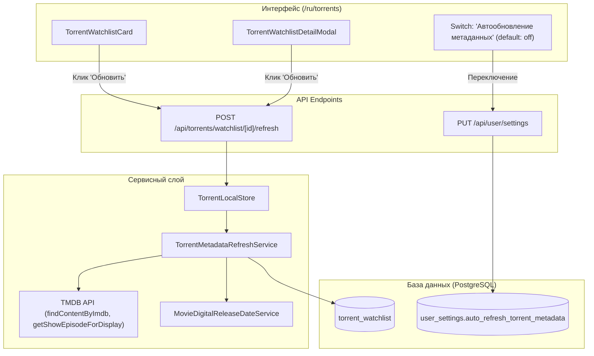

# Архитектура синхронизации метаданных торрентов и тихой сверки дат

> **Версия:** 1.0  
> **Дата:** 2026-09-02  
> **Статус:** Актуально

---

## 1. Назначение

Документ описывает механизм актуализации метаданных (название, оригинальное название, постер, жанры, рейтинг, число сезонов/эпизодов, канонические цифровые даты фильмов и даты выхода серий) для записей отслеживания торрентов (`torrent_watchlist`).

Механизм предоставляет два режима работы:
1. **Ручное обновление по кнопке**: прямое обновление метаданных конкретной открытой карточки пользователем.
2. **Автоматическое фоновое обновление (тихая сверка)**: опциональная фоновая сверка устаревших записей (старше 24 часов) при просмотре списка, выключенная по умолчанию.

---

## 2. Ключевые архитектурные принципы

- **Строгая защита пользовательских настроек:** При обновлении объективных метаданных контента из TMDB/IMDb **никогда не перезаписываются** персональные предпочтения пользователя (`preferredQuality`, `preferredAudio`, `pinnedReleaseKey`, `targetSeason`, `maxReleasesCount`, `notifyOnce`, `telegramChatId`).
- **Безопасность (Security & Authorization):** Все операции обновления выполняются только от имени аутентифицированного пользователя с проверкой `userId === item.userId`.
- **Неблокирующий UI (Non-blocking Stale-While-Revalidate):** Автоматическая сверка выполняется в фоновом пуле без задержки рендеринга страницы.

---

## 3. Схема взаимодействия

---

## 4. Компоненты и ответственность

| Компонент | Путь | Назначение |
|---|---|---|
| `TorrentMetadataRefreshService` | `apps/web/src/lib/services/torrent-metadata-refresh-service.ts` | Логика обновления единичной карточки и пакетной фоновой тихой сверки |
| `TorrentLocalStore` | `apps/web/src/lib/services/torrent-local-store.ts` | CRUD и фасад хранения торрентов |
| Refresh API Route | `apps/web/src/app/api/torrents/watchlist/[id]/refresh/route.ts` | HTTP эндпоинт ручного обновления |
| React Hook | `apps/web/src/modules/torrents/hooks.ts` | Хук `useRefreshTorrentWatchlistItem()` |
| UI Components | `apps/web/src/components/torrents/*` | Карточка, модальное окно и тумблер настроек |

---

## 5. Конфигурация и переменные окружения

- `TORRENT_METADATA_STALE_MS` — порог устаревания метаданных для тихой сверки (по умолчанию `86400000` мс = 24 часа).
- Поле `user_settings.auto_refresh_torrent_metadata` (тип `boolean`, по умолчанию `false`).
